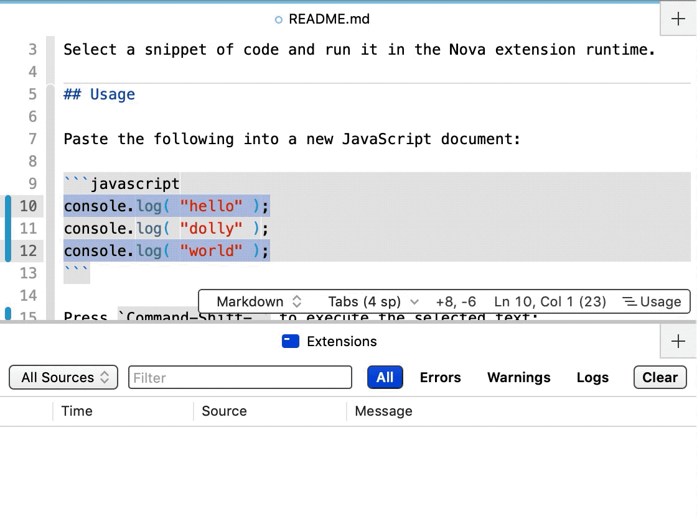

# Run Live

Select a snippet of code and run it in the Nova extension runtime.

## Installation

1. Download the [latest](https://dev.panic.com/ashur/nova-run-live/-/archive/latest/nova-run-live-latest.zip) release archive
1. Unzip the archive
1. Double-click `Run Live.novaextension` to install in Nova

## Usage

Paste the following into a new JavaScript document:

```javascript
console.log( "hello" );
console.log( "dolly" );
console.log( "world" );
```

Press `Command-Shift-.` to execute the selected text:



> 💡 If no text is selected, the contents of the entire document will be run.

## Notes

Selections which call `require` will fail.
